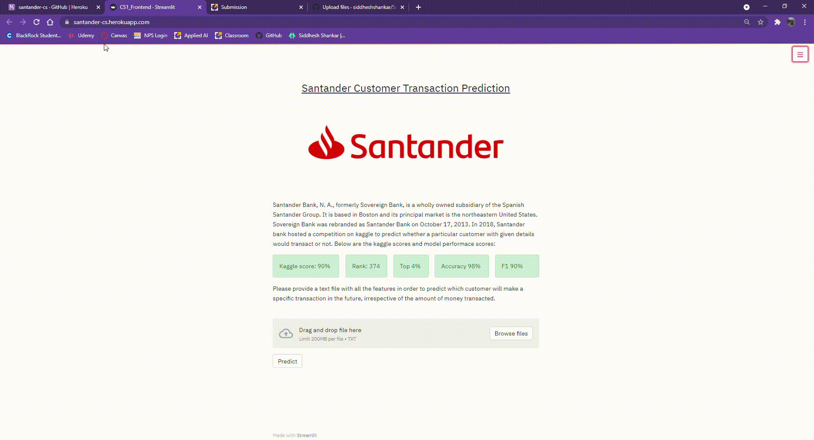

# Santander-Case-Study
Santander Bank poses a challenge to Kagglers in order to help them with the problem of identification of the customers who will make a transaction with the bank in future, irrespective of the amount of money transacted previously with the bank. The data is anonymous with no Customer details been revealed to the participants of the competition. 
Problem tatement: https://www.kaggle.com/c/santander-customer-transaction-prediction/overview

### Approach
- Exploratory Data Analysis
- Feature Engineering using Auto Encoders
- Hyper Parameter Tuning on 6 Machine Learning Models
- Analysing Performance Metrics
- Choosing the Best Model
- Kaggle Scores on all ML Models

